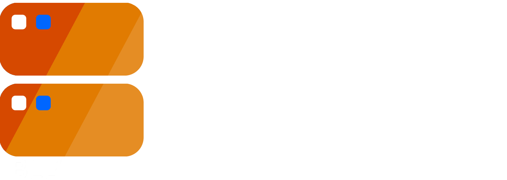

# Super Render Farm

Super Render Farm is an addon for Blender, that makes it possible to setup Pidgeon Render Farm (PRF) projects using Blenders GUI (graphical interface).

## Future Plans
- [ ] 💡⏱️ Uniform GUI for all PidgeonTools addons

❗ = important

💡 = just a rough idea

⏱️ = halted

## Setup
In the preferences you have to set the location of teh Pidgeon Render Farm (Master) executable. That's it!

## Info
[Do you have questions? Join the Discord!](https://discord.gg/cnFdGQP)

## FAQ
### Why is Pidgeon Render Farm itself not an addon?
Because PRF is written in C# opposed to Python, which is used by Blender. We settled on C#, because it is more powerful and faster.

